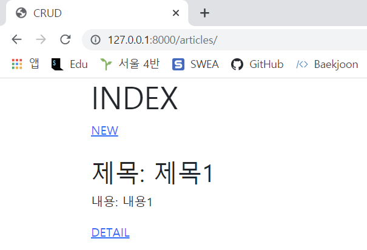
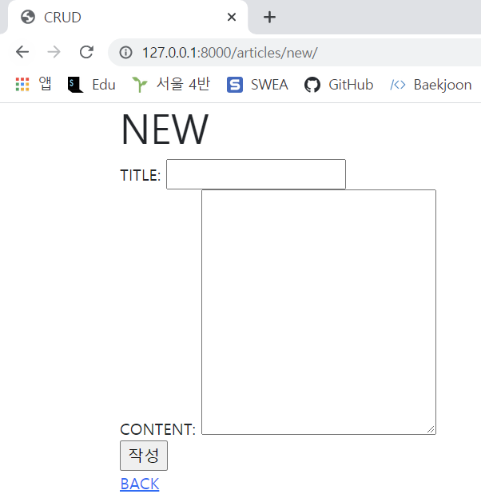
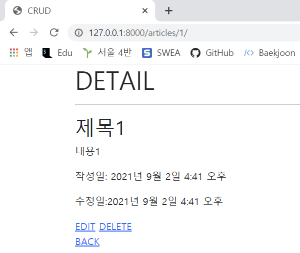
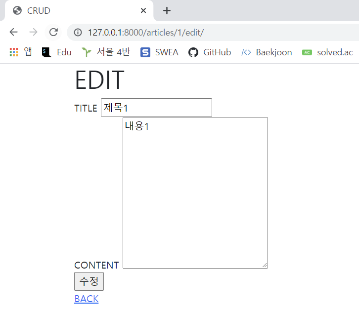

> - 기본 설정
>
>   1. 프로젝트 이름은 crud, 앱 이름은 articles 로 설정한다
>   2. 모든 템플릿에서 상속받아 사용할 base.html 을 작성한다 . base.html 이 위치한 templates 디렉토리는 프로젝트 및 앱 디렉토리와 동일한 위치에 생성한다. base.html 은 Bootstrap CDN 을 포함하고 있어야 한다 .
>
> - CRUD 구현
>
>   1. Read
>
>      
>
>   2. Create
>
>      
>
>   3. Detail
>
>      
>
>   4. Update : 작성을 완료하면 해당 게시글의 상세 페이지 (Detail) 로 이동한다
>
>      
>
>   5. Delete (별도 페이지 없음)

1. Read



2. Create



3. Detail



4. Update



```python
# urls.py
from django.urls import path
from . import views

app_name = 'articles'
urlpatterns = [
    path('', views.index, name='index'),
    path('new/', views.new, name='new'),
    path('create/', views.create, name='create'),
    path('<int:pk>/', views.detail, name='detail'),
    path('<int:pk>/edit/', views.edit, name='edit'),
    path('<int:pk>/update/', views.update, name='update'),
    path('<int:pk>/delete/', views.delete, name='delete'),
]
```

```python
# views.py
from django.shortcuts import redirect, render
from .models import Article

# Create your views here.
def index(request):
    articles = Article.objects.all()

    context = {
        'articles' : articles,
    }
    return render(request, 'articles/index.html', context)

def new(request):
    return render(request, 'articles/new.html')

def create(request):
    if request.method == "POST":
        articles = Article()

        articles.title = request.POST.get('title')
        articles.content = request.POST.get('content')

        articles.save()

    return redirect('articles:detail', articles.pk)

def detail(request, pk):
    article = Article.objects.get(pk=pk)
    
    context = {
        'article' : article,
    }
    return render(request, 'articles/detail.html', context)

def edit(request, pk):
    article = Article.objects.get(pk=pk)
    context = {
        'article': article,
    }
    return render(request, 'articles/edit.html', context)

def update(request, pk):

    article = Article.objects.get(pk=pk)

    article.title = request.POST.get('title')
    article.content = request.POST.get('content')

    article.save()

    return redirect('articles:detail', article.pk)

def delete(request, pk):

    article = Article.objects.get(pk=pk)

    article.delete()

    return redirect('articles:index')
```

```html
<!-- index.html -->




  <h1>INDEX</h1>
  
  <a href="">NEW</a>
  <br>
  
  
  <br>
  <h2>제목: {{ article.title}}</h2>
  <p>내용: {{ article.content }}</p>
  <a href="">DETAIL</a>
  <br>
  <br>
  

  

```

```html
<!-- new.html -->



  <h1>NEW</h1>

  <form action="" method="POST">
    
    <label for="title">TITLE:</label>
    <input type="text" id="title" name="title"><br>
    <label for="content">CONTENT:</label>
    <textarea name="content" id="content" cols="30" rows="10"></textarea><br>
    <input type="submit" value="작성">
  
  </form>

  <a href="">BACK</a>
  


```

```html
<!-- detail.html -->



<h1>DETAIL</h1>
<hr>
<h2>{{ article.title }}</h2>
<p>{{ article.content }}</p>
<p>작성일: {{ article.created_at }}</p>
<p>수정일:{{ article.updated_at }}</p>

<a href="">EDIT</a>
<a href="">DELETE</a>
<br>

<a href="">BACK</a>

```

```html
<!-- edit.html -->



<h1>EDIT</h1>
<form action="" method="POST">
    
    <label for="title">TITLE</label>
    <input type="text" id="title" name="title" value="{{ article.title }}"><br>
    <label for="content">CONTENT </label>
    <textarea name="content" id="content" cols="30" rows="10">{{ article.content }}</textarea><br>
    <input type="submit" value="수정">
</form>

<a href="">BACK</a>


```

