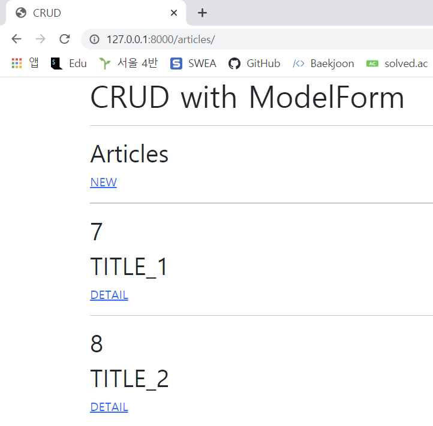
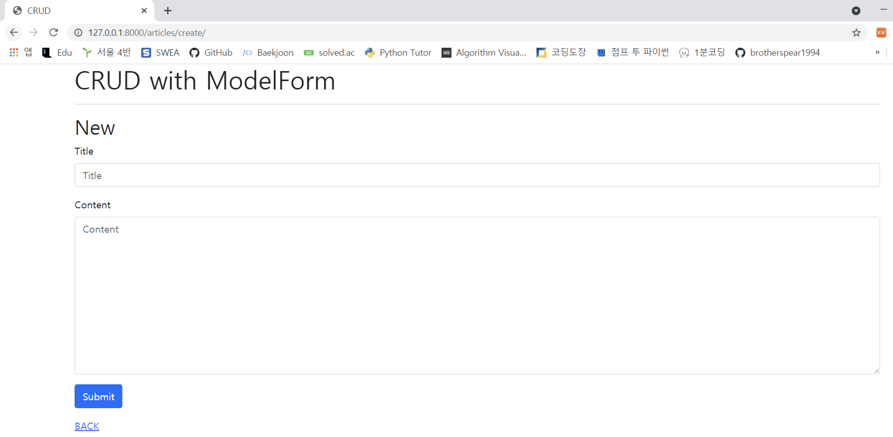
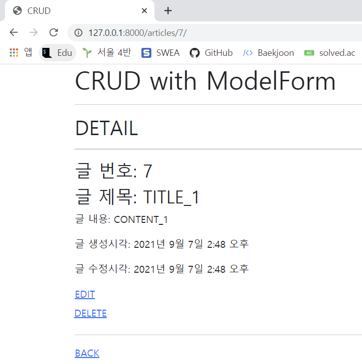
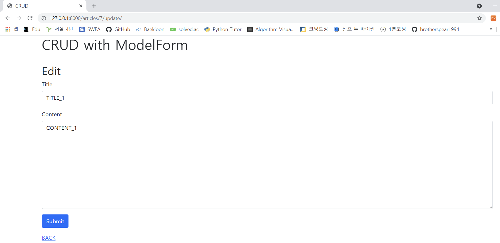

> # Django Project
>
> Django Model Form 을 활용해 CRUD 를 모두 갖춘 장고 프로젝트를 제작하고 결과 사진과 코드를 별도의 마크다운 파일에 작성하여 제출하시오 .
>
> 1. 프로젝트 이름은 crud, 앱 이름은 articles 로 설정한다 .
> 2. 모든 템플릿에서 상속받아 사용할 base.html 을 작성한다. base.html 이 담긴 templates 디렉토리는 프로젝트 및 앱 디렉토리와 동일한 위치에 생성한다. base.html 은 Bootstrap CDN 을 포함하고 있어야 한다

1. Read

   

   ```python
   def index(request):
       articles = Article.objects.all()
       context = {
           'articles': articles,
       }
       return render(request, 'articles/index.html', context)
   ```

   ```html
   
   
   
   
       <h2>Articles</h2>
       <a href="">NEW</a>
       <hr>
       
           <h2>{{ article.pk }}</h2>
           <h2>{{ article.title }}</h2>
           <a href="">DETAIL</a>
           <hr>
       
   
   ```

2. Create

   

   ```python
   @require_http_methods(["GET", "POST"])
   def create(request):
       if request.method == "POST":
           form = ArticleForm(request.POST)
           if form.is_valid():
               form.save()
               return redirect('articles:index')
       else:
           form = ArticleForm()
       context = {
           'form': form,
       }
       return render(request, 'articles/create.html', context)
   ```

   ```html
   
   
   
   
       <h2>New</h2>
       <form action="" method="POST">
           
           
           
               <button type="submit" class="btn btn-primary">
                   Submit
               </button>
           
       </form>
       <a href="">BACK</a>
   
   
   ```

3. Detail

   

   ```python
   def detail(request, pk):
       article = Article.objects.get(pk=pk)
       context = {
           'article': article,
       }
       return render(request, 'articles/detail.html', context)
   ```

   ```html
   
   
   
   
       <h2>DETAIL</h2>
       <hr>
       <h3>글 번호: {{ article.pk }}</h3>
       <h3>글 제목: {{ article.title }}</h3>
       <p>글 내용: {{ article.content }}</p>
       <p>글 생성시각: {{ article.created_at }}</p>
       <p>글 수정시각: {{ article.updated_at }}</p>
       <a href="">EDIT</a>
   
       <form action="" method="POST">
           
           <button class="btn btn-link" style="margin-left:-14px">DELETE</button>
       </form>
   
       <hr>
       <a href="">BACK</a>
   
   ```

4. Update

   

   ```python
   @require_http_methods(["GET", "POST"])
   def update(request, pk):
       article = Article.objects.get(pk=pk)
       if request.method == 'POST':
           form = ArticleForm(request.POST, instance=article)
           if form.is_valid():
               article = form.save()
               return redirect('articles:detail', article.pk)
       else:
           form = ArticleForm(instance=article)
       context = {
           'article': article,
           'form': form,
       }
       return render(request, 'articles/update.html', context)
   ```

   ```html
   
   
   
   
       <h2>Edit</h2>
       <form action="" method="POST">
           
           
           
               <button type="submit" class="btn btn-primary">
                   Submit
               </button>
           
       
       </form>
       <a href="">BACK</a>
   
   
   ```

5. Delete

   ```python
   @require_POST
   def delete(request, pk):
       article = Article.objects.get(pk=pk)
       article.delete()
       return redirect('articles:index')
   ```

   

