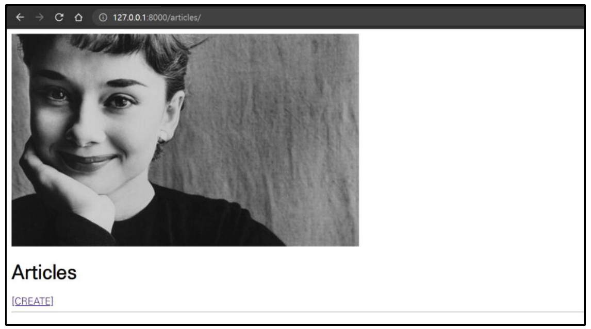

> 사전 제공되는 Django 프로젝트를 기반으로 아래 문제를 순서대로 해결하고 해결하는데 필요한 코드를 작성하시오
>
> 

1. 스크린 샷과 달리 index 페이지에서 메인 이미지가 출력되지 않는다 . 이를 해결하시오

   ```python
   # settings.py
   
   STATICFILES_DIRS = [
   	BASE_DIR / 'static',
   ]
   ```

2. 이미지를 첨부하여 게시글을 작성해보자 . 게시글은 작성되는 듯 하지만 업로드된 이미지가 없습니다 !” 라는 문구가 출력된다. 올바르게 이미지가 업로드 되어 index 페이지 각 게시글에 출력 될 수 있도록 이를 해결하시오.

   ```python
   # urls.py
   
   from django.contrib import admin
   from django.urls import path, include
   from django.conf import settings
   from django.conf.urls.static import static
   
   urlpatterns = [
       path('admin/', admin.site.urls),
       path('articles/', include('articles.urls')),
   ] + static(settings.MEDIA_URL, document_root=settings.MEDIA_ROOT)
   ```

   ```html
   <!-- create.html -->
   
   <!DOCTYPE html>
   <html lang="en">
   <head>
     <meta charset="UTF-8">
     <meta http-equiv="X-UA-Compatible" content="IE=edge">
     <meta name="viewport" content="width=device-width, initial-scale=1.0">
     <title>Document</title>
   </head>
   <body>
     <h1>CREATE</h1>
     <form action="" method="POST" enctype="multipart/form-data">
       
       {{ form.as_p }}
       <input type="submit">
     </form>
     <a href="">[back]</a>
   </body>
   </html>
   ```

   