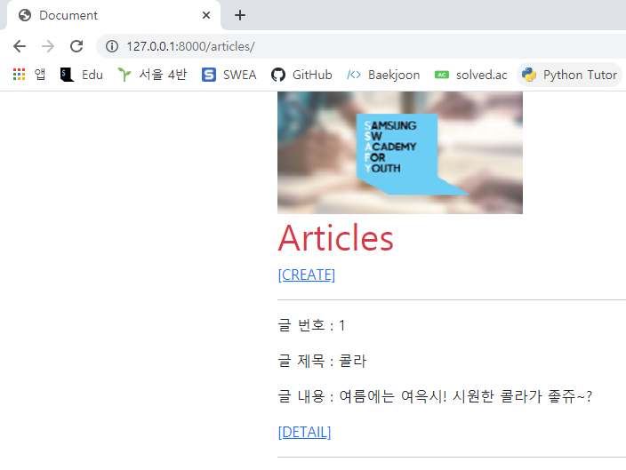
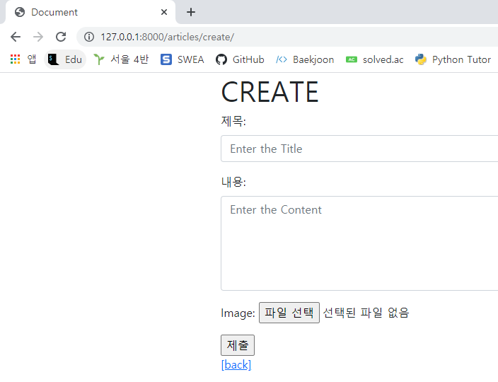
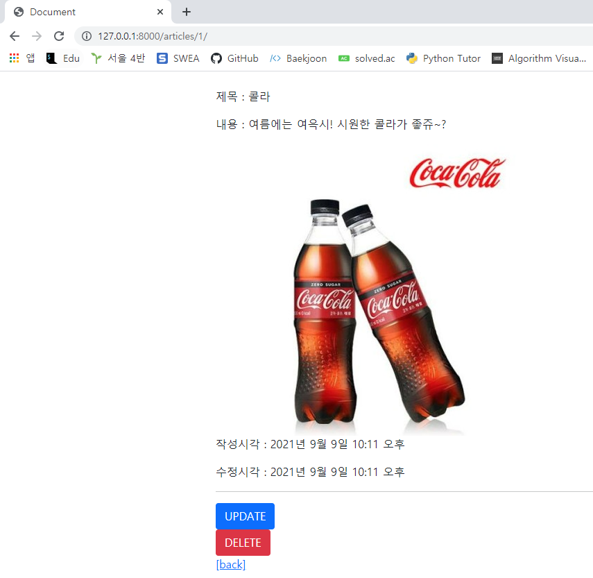
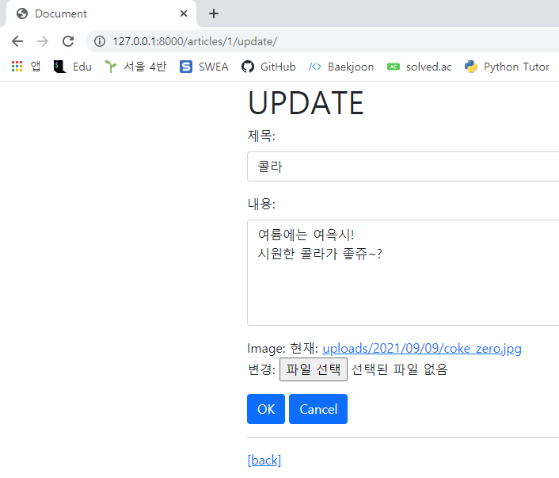

1. Read

   

   ```html
   <!-- index.html -->
   
   
   
   
     
     <h1 class="text-danger">Articles</h1>
     <a href="">[CREATE]</a>
     <hr>
     
       <p>글 번호 : {{ article.pk }}</p>
       <p>글 제목 : {{ article.title }}</p>
       <p>글 내용 : {{ article.content }}</p>
       <a href="">[DETAIL]</a>
       <hr>
     
   
   ```

   ```python
   # views.py
   
   def index(request):
       articles = Article.objects.order_by('-pk')
       context = {
           'articles': articles,
       }
       return render(request, 'articles/index.html', context)
   ```

2. Create

   

   ```python
   # views.py
   
   @require_http_methods(['GET', 'POST'])
   def create(request):
       if request.method == 'POST':
           form = ArticleForm(request.POST, request.FILES)
           imageform = ArticleImageForm(request.POST, request.FILES)
           if form.is_valid():
               article = form.save()
               imageform.save()        
               return redirect('articles:detail', article.pk)
       else:
           form = ArticleForm()
           imageform = ArticleImageForm()
       context = {
           'form': form,
           'imageform': imageform,
       }
       return render(request, 'articles/create.html', context)
   ```

   ```html
   <!-- create.html -->
   
   
   
   
     <h1>CREATE</h1>
     <form action="" method="POST" enctype="multipart/form-data">
       
       
       {{ imageform.as_p }}
       <input type="submit" value="제출" accept="image/*">
     </form>
     <a href="">[back]</a>
   
   ```

3. Detail

   

   ```python
   # views.py 
   
   def detail(request, pk):
       article = get_object_or_404(Article, pk=pk)
       articleimage = get_object_or_404(ArticleImage, pk=pk)
       context = {
           'article': article,
           'articleimage': articleimage,
       }
       return render(request, 'articles/detail.html', context)
   ```

   ```html
   <!-- detail.html -->
   
   
   
   
     <br>
     <p>제목 : {{ article.title }}</p>
     <p>내용 : {{ article.content }}</p>
     
       
     
     <p>작성시각 : {{ article.created_at }}</p>
     <p>수정시각 : {{ article.updated_at }}</p>
     <hr>
     <a href="">
       <button class="btn btn-primary">UPDATE</button>
     </a>
     <form action="" method="POST">
       
       <button class="btn btn-danger">DELETE</button>
     </form>
     <a href="">[back]</a>
   
   ```

4. Update

   

   ```python
   # views.py
   @require_http_methods(['GET', 'POST'])
   def update(request, pk):
       article = get_object_or_404(Article, pk=pk)
       articleimage = get_object_or_404(ArticleImage, pk=pk)
       if request.method == 'POST':
           form = ArticleForm(request.POST, request.FILES, instance=article)
           imageform = ArticleForm(request.POST, request.FILES, instance=articleimage)
           if form.is_valid():
               form.save()
               imageform.save()
               return redirect('articles:detail', article.pk)
       else:
           form = ArticleForm(instance=article)
           imageform = ArticleImageForm(instance=articleimage)
       context = {
           'article': article,
           'form': form,
           'imageform': imageform,
       }
       return render(request, 'articles/update.html', context)
   ```

   ```html
   <!-- update.html -->
   
   
   
   
     <h1>UPDATE</h1>
     <form action="" method="POST" enctype="multipart/form-data">
       
       
       {{ imageform.as_p }}
       
     </form>
     <hr>
     <a href="">[back]</a>
   
   ```

5. Delete

   ```python
   # views.py
   
   @require_POST
   def delete(request, pk):
       article = get_object_or_404(Article, pk=pk)
       articleimage = get_object_or_404(ArticleImage, pk=pk)
       article.delete()
       articleimage.delete()
       return redirect('articles:index')
   ```

   

