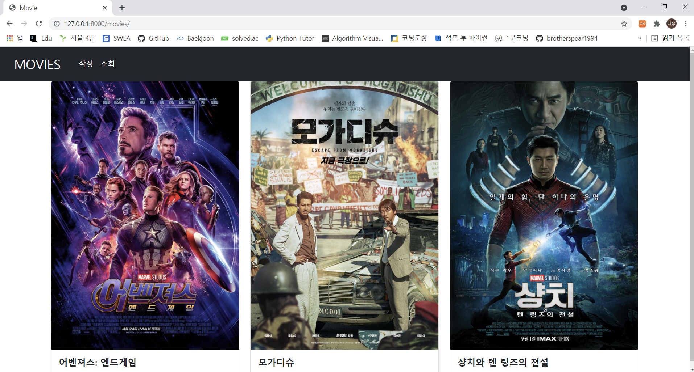
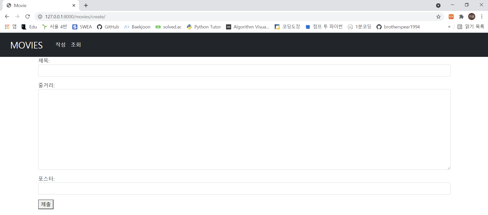
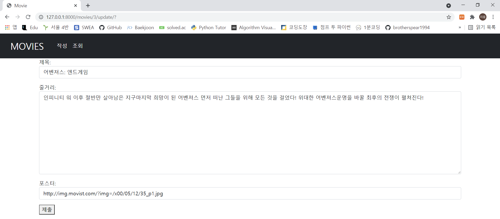
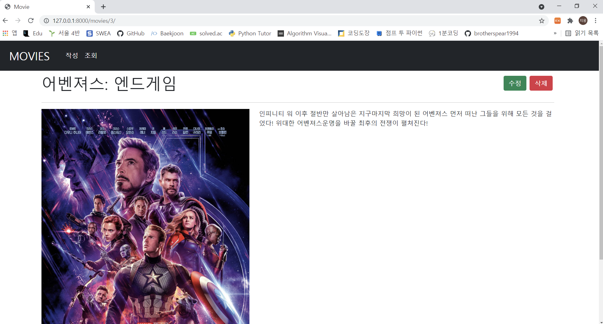
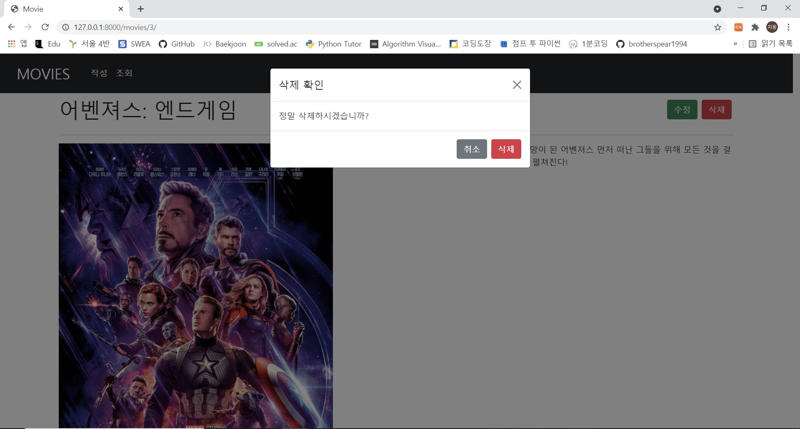

1. Read

   

   ```python
   # views.py
   
   @require_safe
   def index(request):
       movies = Movie.objects.all()
       context = {
           'movies': movies,
       }
       return render(request, 'movies/index.html', context)
   ```

   ```html
   <!-- index.html -->
   
   
   
   
       <form action="" method="POST">
           
           {{ form.as_p }}
           <button>제출</button>
       </form> 
   
   ```

2. Create

   

   ```python
   # views.py
   
   @require_http_methods(['GET', 'POST'])
   def create(request):
       if request.method == 'POST':
           form = MovieForm(request.POST)
           if form.is_valid():
               form.save()
               return redirect('movies:index')
       else:
           form = MovieForm()
       context = {
           'form': form,
       }
       return render(request, 'movies/create.html', context)
   ```

   ```html
   <!-- create.html -->
   
   
   
   
       <form action="" method="POST">
           
           {{ form.as_p }}
           <button>제출</button>
       </form> 
   
   ```

3. Update

   

```python
# views.py

@require_http_methods(['GET', 'POST'])
def update(request, pk):
    movie = Movie.objects.get(pk=pk)
    if request.method == 'POST':
        form = MovieForm(request.POST, instance=movie)
        if form.is_valid():
            form.save()
            return redirect('movies:detail', movie.pk)
    else:
        form = MovieForm(instance=movie)
    context = {
        'form': form,
        'movie': movie,
    }
    return render(request, 'movies/update.html', context)
```

```html
<!-- update.html -->




    <form action="" method="POST">
        
        {{ form.as_p }}
        <button>제출</button>
    </form> 

```

4. Detail

   

   ```python
   # views.py 
   
   @require_safe
   def detail(request, pk):
       movie = Movie.objects.get(pk=pk)
       context = {
           'movie': movie,
       }
       return render(request, 'movies/detail.html', context)
   ```

   ```html
   <!-- detail.html -->
   
   
   
   
        <h1>제목 : {{ movie.title }}</h1>
       <h2>내용 : {{ movie.overview }}</h2>
       
   
       <a href="">수정</a>
       <form action="" method="POST">
           
           <button>삭제</button>
       </form>  
   
       <div class="row justify-content-between">
       <h1 class="col-12 col-sm-6 mt-2">{{ movie.title }}</h1> <br>
       <div class="col-3 d-flex justify-content-end align-items-center">
         <form action="" method="GET" class="d-inline mx-1">
           <input type="submit" class="btn btn-success" value="수정">
         </form>
         <input type="button" class="btn btn-danger mx-1" value="삭제" data-bs-toggle="modal" data-bs-target="#deleteModal">
       </div>
     </div> <hr>
     <div class="row">
       <div class="col-5">
         
       </div>
       <div class="col-7">
          <h3>{{ movie.title }}</h3> 
         <p>{{ movie.overview|linebreaksbr}}</p> 
       </div>
     </div>
     <div class="modal fade" id="deleteModal" tabindex="-1" aria-labelledby="exampleModalLabel" aria-hidden="true">
       <div class="modal-dialog">
         <div class="modal-content">
           <div class="modal-header">
             <h5 class="modal-title" id="exampleModalLabel">삭제 확인</h5>
             <button type="button" class="btn-close" data-bs-dismiss="modal" aria-label="Close"></button>
           </div>
           <div class="modal-body">
             정말 삭제하시겠습니까?
           </div>
           <div class="modal-footer">
             <button type="button" class="btn btn-secondary" data-bs-dismiss="modal">취소</button>
             <form action="" method="POST">
               
               <input type="submit" class="btn btn-danger" value="삭제" data-bs-toggle="modal" data-bs-target="#deleteModal">
             </form>
           </div>
         </div>
       </div>
     </div>
   
   ```

5. Delete

   

   ```python
   # views.py
   
   @require_POST
   def delete(request, pk):
       movie = Movie.objects.get(pk=pk)
       movie.delete()
       return redirect('movies:index')
   ```

   