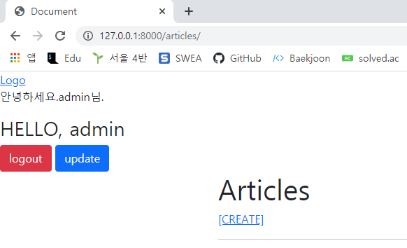
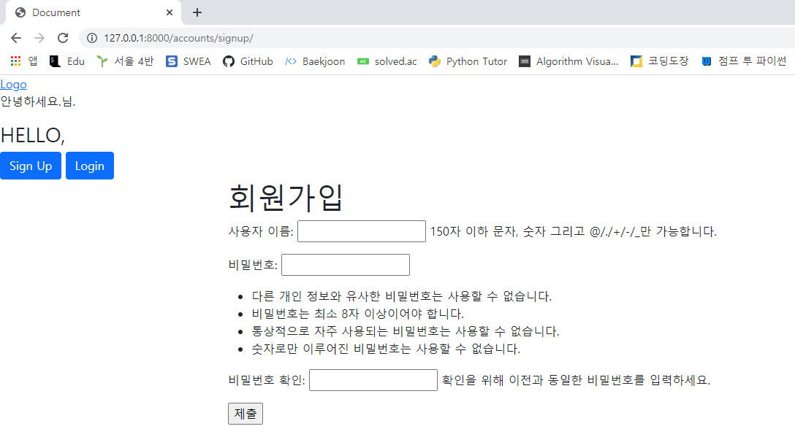

# Accounts CR

## 1. /accounts/

> 유저 목록을 출력하는 페이지를 나타낸다

```python
# accounts/urls.py
from django.urls import path
from . import views

app_name = 'accounts'
urlpatterns = [
    path('', views.users, name = 'users'),
    ...
]
```

```python
# accounts/views.py
from django.contrib.auth import get_user_model

def users(request):
    user_list = get_user_model().objects.all()
    context = {
        'user_list': user_list,
    }
    return render(request, 'accounts/users.html', context)
```



## 2. /accounts/signup/

> 회원가입 작성을 위한 페이지를 나타낸다. 유저를 생성하는 기능을 수행한다

```python
# accounts/urls.py
from django.urls import path
from . import views


app_name = 'accounts'
urlpatterns = [
    ...
    path('signup/', views.signup, name = 'signup'),
    ...
]
```

```python
# accounts/views.py
from django.contrib.auth.forms import UserCreationForm

def signup(request): 
    if request.user.is_authenticated:
        return redirect('articles:index')
    if request.method == 'POST':
        form = UserCreationForm(request.POST)
        if form.is_valid():
            form.save()
            return redirect('articles:index')
    else:
        form = UserCreationForm()
    context = {
        'form': form,
    }
    return render(request, 'accounts/signup.html', context)
```



