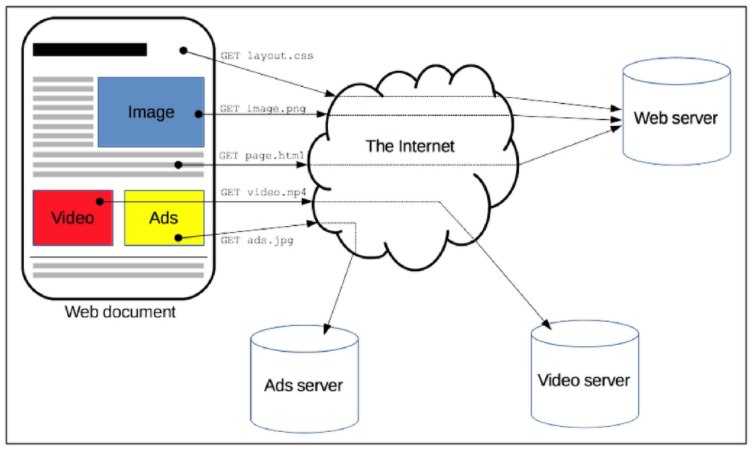
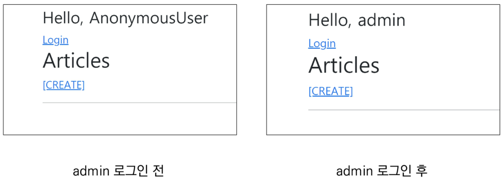

## Authentication System

### Django Authentication System

- `django.contrib.auth` : 인증 프레임워크 핵심, 기본 모델

- `django.contrib.contenttypes` : 사용자 생성 모델 ~ 권한 연결

- Authentication (인증) 

  - 신원 확인

- Authorization (권한, 허가)

  - 권한 부여

  ```bash
  $ python manage.py startapp accounts
  ```

  ```python
  # settings.py
  INSTALLED_APPS = [
      'articles',
      'accounts',
      ...
  ]
  
  # crud/urls.py
  urlpatterns = [
      path('accounts/', include('accounts.urls'))
  ]
  
  # accounts/urls.py
  from django.urls import path
  from . import views
  
  app_name = 'accounts'
  urlpatterns = [
      
  ]
  ```

### 쿠키, 세션

#### HTTP

- Hyper Text Transfer Protocol
  - 리소스 (자원, 데이터)들을 가져올 수 있는 프로토콜 (규칙, 규약)
  - 웹에서 이루어지는 모든 데이터 교환 기초
  - 클라이언트 - 서버 프로토콜
  - 
  - 비연결지향 (connectionless)
    - 서버 : 요청 응답 -> 연결 끊음
  - 무상태 (stateless)
    - 연결 끊는 수간 -> 클라이언트 ~ 서버 통신 끝, 상태 정보 유지 X
    - 클라이언트 ~ 서버 메시지 : 독립적
  - 클라이언트 ~ 서버 지속적 관계 유지 위한 쿠키, 세션

#### 쿠키 (Cookie)

- 서버 -> 사용자 웬 브라우저 : 작은 데이터 조각
- 로컬에 key-value 데이터 형식으로 저장
- HTTP 쿠키 : 상태가 있는 세션 -> 로그인 상태 유지 가능, 상태가 없는 HTTP 프로토콜에서 상태 정보 기억
- **웹 페이지에 접속 시 요청한 웹 페이지를 받으면서 쿠키 저장, 클라이언트가 같은 서버에 재요청 시 쿠키도 함께 전송**


- 사용 목적
  - 세션 관리 (session management) : 로그인, 자동 완성, 공지 하루 안보기, 팝업 체크, 장바구니 등
  - 개인화 (personalization) : 사용자 선호, 테마
  - 트래킹 (tracking) : 사용자 행동 기록, 분석
- 수명
  - session cookies : 세션 종료 시 삭제, 브라우저가 현재 세션 종료 시기 정의
  - persistent (permanent) cookies : expire 속성 or max-age 속성에 지정

#### 세션 (Session)

- 사이트와 특정 브라우저 사이 상태 (state) 유지
- 클라이언트가 서버에 접속 시 특정 session id 발급 -> 쿠키에 저장 (id만)
- `SessionMiddleware` : 요청 전반에 걸쳐 세션 관리
- `AuthenticationMiddleware` : 세션 사용 -> 사용자 ~ 요청 연결

### 로그인

- Session Create

- `AuthenticationForm` : request를 첫 번째 인자로

- `login(request, user, backend=None)`

  - HttpRequest, User 객체 필요
  - django의 session framework 사용 -> 세션에 user ID 저장

  ```python
  # accounts/urls.py
  from django.urls import path
  from . import views
  
  app_name = 'accounts'
  urlpatterns = [
      path('login/', views.login, name='login'),
  ]
  ```

  ```html
  <!-- accounts/login.html -->
  
  
  	<h1>로그인</h1>
  	<form action="" method="POST">
      	
          {{ form.as_p }}
          <input type="submit">
  	</form>
  
  ```

  ```python
  # accounts/views.py
  from django.shortcuts import render, redirect
  from django.contrib.auth import login as auth_login  # login view 함수와 혼동 방지
  from django.contrib.auth.foms import AuthenticationForm
  from django.views.decorators.http import require_http_methods
  
  @require_http_methods(['GET', 'POST'])
  def login(request):
      if request.method == 'POST':
          form = AuthenticationForm(request, request.POST)
          if form.is_valid():
              auth_login(request, form.get_user())
      else:
          form = AuthenticationForm()
      context = {
          'form': form,
      }
      return render(request, 'accounts/login.html', context)
  ```

- `get_user()`

  - `user_cache` : 생성 시 None으로 할당 -> 유효성 검사 시 로그인 한 사용자 객체로 할당

  - 유효성 먼저 확인 -> 유효할 때만 user 제공

    ```python
    class AuthenticationForm(forms.Form):
        """
        Base class for authenticating users. Extend this to get a form that accepts username/password logins.
        """
        def get_user(self):
            return self.user_cache
    ```

    ```html
    <!-- base.html -->
    
    <body>
        <div class="container">
            <h3>Hello, {{ user }}</h3>
            <a href="">Login</a>
            
            
        </div>
    </body>
    ```

    

- Authentication data in templates

  - context processors

    - 템플릿 렌더링 시 자동으로 호출 가능한 context data 목록
    - `RequestContext`에서 사용 가능한 변수로 포함

  - Users

    - 현재 로그인한 사용자 `auth.User` or `AnonymousUser` -> `{{ user }}` 에 저장

    ```python
    # setting.py
    
    TEMPLATES = [
        {
            'BACKEND' : 'django.template.backends.django.DjangoTemplates',
            'DIRS' : [BASE_DIR / 'templates',],
            'APP_DIRS' : True,
            'OPTIONS' : {
                'context_processors' : [
                    'django.template.context_processors.debug',
                    'django.template.context_processors.request',
                    'django.contrib.auth.context_processors.auth',
                    'django.contrib.messages.context_processors.messages',
                ],
            },
        },
    ]
    ```

### 로그아웃

- same with delete

- `logout(request)`

  - `HttpRequest` 객체 인자, 반환 X
  - 로그인 X -> 오류 X
  - session data DB, 쿠키에서 삭제, 
  - 이전 사용자 세션 데이터 액세스 방지

  ```python
  # accounts/urls.py
  
  path('logout/', views.logout, name='logout'),
  
  # accounts.views.py
  
  from django.views.decorators.http import require_POST
  from django.contrib.auth import logout as auth_logout
  
  @require_POST
  def logout(request):
      auth_logout(request)
      return redirect('articles:index')
  ```

  ```html
  <!-- base.html -->
  
  <body>
      <div class="container">
          <h3>Hello, {{ user }}</h3>
          <a href="">Login</a>
          <form action="" method="POST">
              
              <input type="submit" value="logout">
          </form>
          
          
      </div>
  </body>
  ```

### 로그인 접근 제한

- `is_authenticated`

  - User model 속성

  - 모든 User instance에 항상 True : 읽기 전용, `AnonymousUser`는 False

  - 사용자 인증 여부

  - `request.user`에서 `django.contrib.auth.middleware.AuthenticationMiddleware` 통과 여부 확인

  - 권한 (permission) 관련 X, active, valid session 확인 X

    ```html
    <!-- base.html -->
    
    <body>
        <div class="container">
          
            <h3>Hello, {{ user }}</h3>
            <a href="">Login</a>
            <form action="" method="POST">
                
                <input type="submit" value="logout">
            </form>
          
          
          
        </div>
    </body>
    
    <!-- articles/index.html -->
    
    
    
    	<h1>Articles</h1>
    	
    		<a href="">[CREATE]</a>
    	
    		<a href="">[새 글을 작성하려면 로그인하세요]</a>
    	
    
    ```

    ```python
    # accounts/views.py
    
    @require_http_methods(['GET', 'POST'])
    def login(request):
        if request.user.is_authenticated:
            return redirect('articles:index')
        
    @require_POST
    def logout(request):
        if request.user.is_authenticated:
        	auth_logout(request)
        return redirect('articles:index')
    ```

- `login_required` 

  - 로그인 X : `settings.LOGIN_URL`에 설정된 경로로 redirect

  - next 매개 변수에 저장

    ```python
    # articles/views.py
    
    from django.contrib.auth.decorators import login_required
    
    @login_required
    @require_http_methods(['GET', 'POST'])
    def create(request):
        pass
    
    @login_required
    @require_http_methods(['GET', 'POST'])
    def update(request, pk):
        pass
    
    @login_required
    @require_POST
    def delete(request, pk):
        if request.user.is_authenticated:
        	article = get_object_or_404(Article, pk=pk)
        	article.delete()
        return redirect('articles:index')
    ```

    ```python
    # accounts/views.py
    
    @require_http_methods(['GET', 'POST'])
    def login(request):
        if request.user.is_authenticated:
    		return redirect('articles:index')
        
        if request.method == 'POST':
            form = AuthenticationForm(request, request.POST)
            # form = AuthenticationForm(request, data=request.POST)
            if form.is_valid():
                auth_login(request, form.get_user())
                return redirect(request.GET.get('next') or 'articles:index')
            
        else:
            form = AuthenticationForm()
        context = {
            'form': form,
        }
       	return render(request, 'accounts/login.html', context)
    ```

    ```html
    <!-- accounts/login.html -->
    
    
    
    	<h1>로그인</h1>
    	<form action="" method="POST">
        	
            {{ form.as_p }}
            <input type="submit">
    	</form>
    
    ```

### 회원가입

- `UserCreationForm`

  - `username`, `password1`, `password2` 필드 

    ```python
    class UserCreationForm(forms.ModelForm):
        """
        A form that creates a user, with no privileges, from the given username and password
        """
        error_message = {
            'password_mismatch': _('The two password fields didnt match.')
        }
        password1 = forms.CharField(
        	label=_("Password"),
            strip=False,
            widget=forms.PasswordInput(attrs={'autocomplete':'new-password'}),
            help_text=password_validation.password_validators_help_text_html(),
        )
        password2 = forms.CharField(
        	label=_("Password confirmation"),
            widget=forms.PasswordInput(attrs={'autocomplete': 'new-password'}),
            strip=False,
            help_text=_("Enter the same password as before, for verification")
        )
    ```

    ```python
    # accounts/urls.py
    
    app_name = 'accounts'
    urlpatterns = [
        path('signup/', views.signup, name='signup'),
    ]
    
    # accounts/views.py
    
    from django.contrib.auth.forms import AuthenticationForm, UserCreationForm
    
    @require_http_methods(['GET', 'POST'])
    def signup(request):
        if request.method == 'POST':
            form = UserCreationForm(request.POST)
            if form.is_valid():
                user = form.save()
                auth_login(request, user)
                return redirect('articles:index')
        else:
            form = UserCreationForm()
        context = {
            'form': form,
        }
        return render(request, 'accounts/signup.html', context)
    ```

    ```html
    <!-- accounts/sigup.html -->
    
    
    	<h1>회원가입</h1>
    	<form action="" method="POST">
        	
            {{ form.as_p }}
            <input type="submit">
    	</form>
    
    
    <!-- base.html -->
    
    <body>
        <div class="container">
          
            <h3>Hello, {{ user }}</h3>
            <form action="" method="POST">
                
                <input type="submit" value="logout">
            </form>
          
            <a href="">Login</a>
            <a href="">Signup</a>
          
          
          
        </div>
    </body>
    ```

### 회원탈퇴

```python
# accounts/urls.py

app_name = 'accounts'
urlpatterns = [
    path('delete/', views.delete, name='delete'),
]

# accounts/views.py

from django.views.decorators.http import require_POST

@require_POST
def delete(request):
    if request.user.is_authticated:
        request.user.delete()
        auth_logout(request)
    return redirect('articles:index')
```

```html
<!-- base.html -->

<body>
    <div class="container">
      
        <h3>Hello, {{ user }}</h3>
        <form action="" method="POST">
            
            <input type="submit" value="logout">
        </form>
        <form action="" method="POST">
            
            <input type="submit" value="회원탈퇴">
        </form>
      
        <a href="">Login</a>
        <a href="">Signup</a>
      
      
      
    </div>
</body>
```

### 회원정보 수정

```python
class UserChangeForm(forms.ModelForm):
    password = ReadOnlyPasswordHashField(
    	label=_("Password"),
        help_text=_(
        	'Raw passwords are not stored, so there is no way to see this '
            'users password, but you can change the password using'
            '<a href="{}">this form</a>'
        ),
    )
    class Meta:
        model = User
        fields = '__all__'
        field_classes = {'username': UsernameField}
```

```python
# accounts/urls.py

app_name = 'accounts'
urlpatterns = [
    path('update/', views.update, name='update'),
]

# accounts/views.py

from django.contrib.auth.forms import AuthenticationForm, UserCreationForm, UserChangeForm

@require_http_methods(['GET', 'POST'])
def update(request):
    if request.method == 'POST':
        pass
    else:
        form = UserChangeForm(instance=request.user)
    context = {
        'form': form,
    }
    return render(request, 'accounts/update.html', context)
```

```html
<!-- accounts/update.html -->



	<h1>회원정보 수정</h1>
	<form action="" method="POST">
    	
        {{ form.as_p }}
        <input type="submit">
	</form>


<!-- base.html -->

<body>
    <div class="container">
      
        <h3>Hello, {{ user }}</h3>
        <a href="">회원정보 수정</a>
        <form action="" method="POST">
            
            <input type="submit" value="logout">
        </form>
      
        <a href="">Login</a>
        <a href="">Signup</a>
      
      
      
    </div>
</body>
```

- 일반 사용자가 접근하면 안되는 것까지 모두 수정 가능

  - `CustomUserChangeForm`

    ```python
    # accounts/forms.py
    
    from django.contrib.auth.forms import UserChangeForm
    from django.contrib auth import get_user_model
    
    class CustomUserChangeForm(UserChangeForm):
        class Meta:
            model = get_user_model()
            fields = ('email', 'first_name', 'last_name')
            
    # accounts/views.py
    
    from django.contrib.auth.decorators import login_required
    from .forms import CustomUserChangeForm
    
    @login_required
    @require_http_method(['GET', 'POST'])
    def update(request):
        if request.method == 'POST':
            form = CustomUserChangeForm(request.POST, instance=request.user)
            if form.is_valid():
                form.save()
                return redirect('articles:index')
        else:
            form = CustomUserChangeForm(instance=request.user)
        context = {
            'form': form,
        }
        return render(request, 'accounts/update.html', context)
    ```

### 비밀번호 변경

- `SetPasswordForm`

  ```python
  # accounts/urls.py
  
  app_name = 'accounts'
  urlpatterns = [
      path('password/', views.change_password, name='change_password'),
  ]
  
  # accounts/views.py
  
  from django.contrib.auth.forms import PasswordChangeForm
  from django.contrib.auth import update_session_auth_hash
  
  @login_required
  @require_http_method(['GET', 'POST'])
  def change_password(request):
      if request.method == 'POST':
          form = PasswordChangeForm(request.user, request.POST)
          if form.is_valid():
              form.save()
              update_session_auth_hash(request, form.user)
              return redirect('articles:index')
      else:
          form = PasswordChangeForm(request.user)
      context = {
          'form': form,
      }
      return render(request, 'accounts/change_password.html', context)
  ```

  ```html
  <!-- accounts/change_password.html -->
  
  
  
  	<h1>비밀번호 변경</h1>
  	<form action="" method="POST">
      	
          {{ form.as_p }}
          <input type="submit">
  	</form>
  
  ```

  - `update_session_auth_hash(request, form.user)`
    - 암호 변경 시 세션 무효화 방지
    - 현재 요청과 새 session hash가 업데이트 된 사용자 객체 가져오고, 업데이트