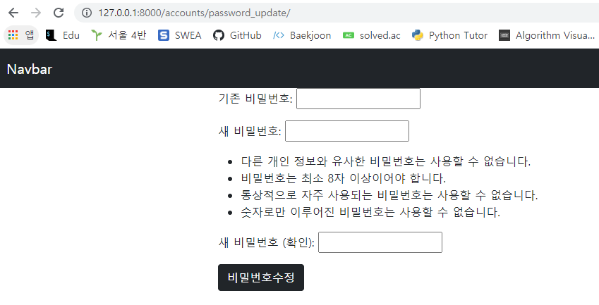

# 1. User Change Password

> /accounts/password/ 형식의 url을 가지며, 유저의 비밀번호 수정 기능을 구현한다.



```python
# accounts/views.py
@login_required
def password_update(request):
    if request.method == 'POST':
        form = PasswordChangeForm(request.user, request.POST)
        if form.is_valid():
            user = form.save()
            auth_login(request, user)
            return redirect('articles:index')
    else:
        form = PasswordChangeForm(request.user)
    context = {
        'form': form,
    }
    return render(request, 'accounts/password_update.html', context)
```

```html
<!-- accounts/password_update.html -->



  <form action="" method="POST">
    
    {{ form.as_p }}
    <button class="btn btn-dark">비밀번호수정</button>
  </form>

```

