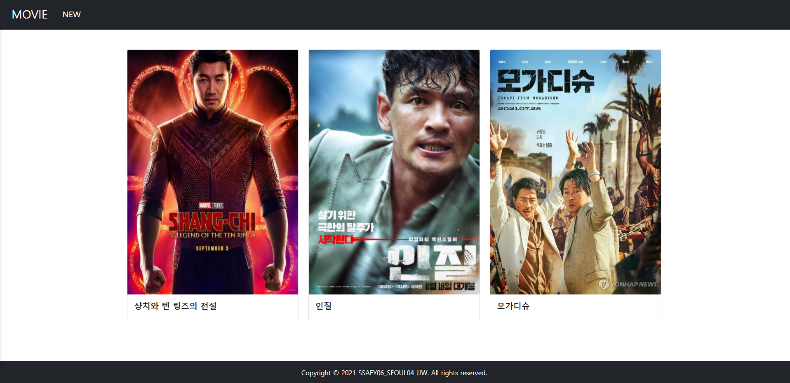
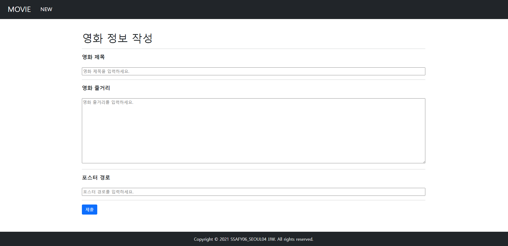
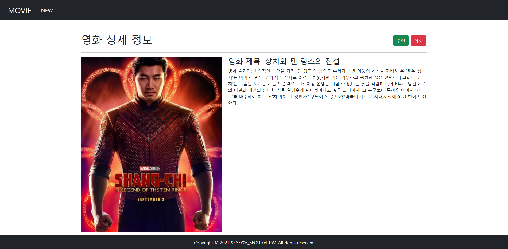
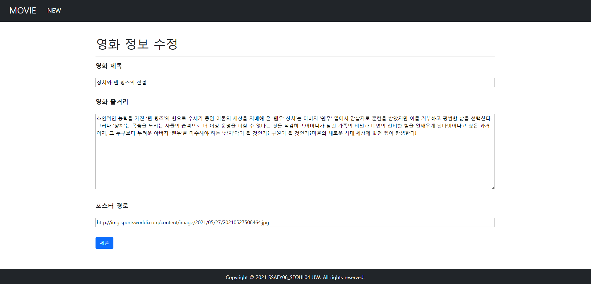
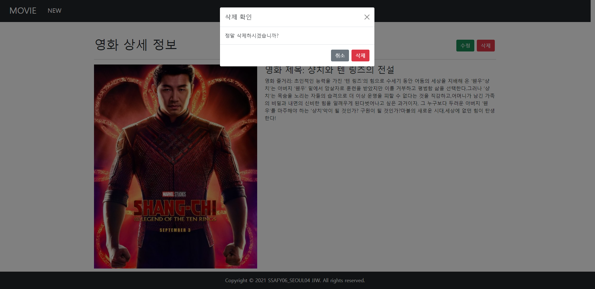

# PJT 04 : Django 기반 영화 웹사이트 구현

- 기간 : 2021-09-02 ~ 2021-09-02

- 사용 라이브러리

  - [Django]: https://www.djangoproject.com/	"Django"

  - [Bootstrap]: https://getbootstrap.com/	"Bootstrap"

- Result

  - Read

    

  - Create

    

  - Detail

    

  - Update

    

  - Delete

    

