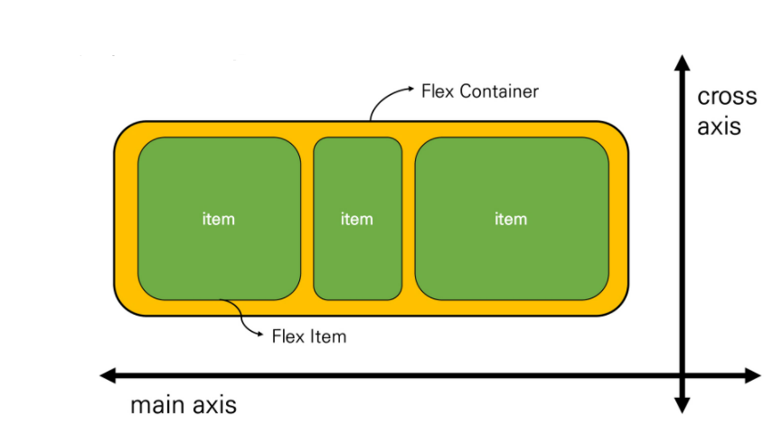

https://www.youtube.com/watch?v=8xKDSdHQ35U

https://getbootstrap.com/docs/5.0/getting-started/introduction/

# CSS Layout

## Float

### Float Clear

- 맨 마지막 자식으로 가상 요소 생성
- Content 속성과 장식 콘텐츠 추가
- Default : Inline
- 선행 Floating 다음일지 or 내려가야 하는지 지정
- 부동, 비부동 모두 적용

### Flexbox

- 1차원 (단방향) 레이아웃
- 요소
  - Flex Container (부모) 
    - Display : Flex or Inline-Flex
  - Flex Item (자식)
- 축
  - Main Axis (메인축)
  - Cross Axis (교차축)

#### 속성

- 배치 방향 : flex-direction
  - main axis 방향만 바뀜 : 단방향 레이아웃 (reverse)
- 메인축 방향 : justify-direction
- 교차축 방향 : align-items, align-self, align-content
- 기타 : flex-wrap, flex-flow, flex-grow

#### Content & Items & Self

- content : 여러 줄
- Items : 한 줄
- Self : Item 개별 요소

#### Justify & Align

- Justify-Content (메인축 기준 여러 줄)
  - flex-start : 시작 지점부터
  - flex-end : 뒤쪽부터
  - center
  - space-between : 좌우 정렬
  - space-around : 균등 좌우 정렬 (내부 요소 여백 : 외곽 여백 * 2)
  - space-evenly : 균등 정렬 (내부 요소 여백 = 외곽 여백)
- Align-Items
  - flex-start, flex-end, center, stretch, baseline (item 내부 text에 기준선)
- Align-Content
  - flex-start, flex-end, center, stretch, space-between, space-around
- Align-Self
  - auto, flex-start, flex-end, center, stretch (부모 컨테이너 맞춰서 자동으로), baseline

#### Wrap & Flow

- Wrap
  - 강제로 한 줄에 배치
  - nowrap (기본 값) : 모든 아이템 한 줄 (자리가 없어도)
  - wrap : 넘치면 그 다음 줄
  - wrap-reverse : 넘치면 그 윗 줄
- Flow
  - flex-direction, flex-wrap shorthand : 설정 값 차례로 설정

# Bootstrap

## CDN 

- Content Delivery(Distribution) Network
- 컨텐츠를 효율적으로 전달하기 위한 여러 노드를 가진 네트워크에 데이터 제공 시스템
- 개별 end-user의 가까운 서버를 통해 빠르게 전달 가능
- 외부 서버를 활용하여 본인 서버 부하 down

## Responsive Web

# Bootstrap Grid System

## Grid System

- Flexbox
- Container, Rows, Column으로 콘텐츠 배치, 정렬
- 12개 column, 6개 grid breakpoint
