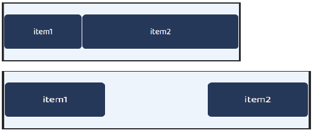
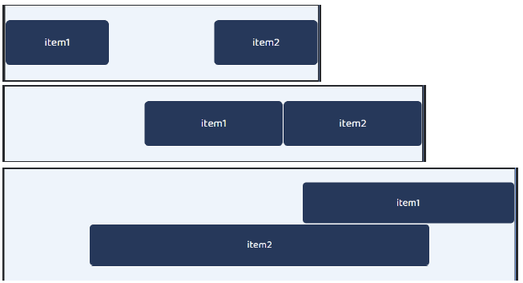
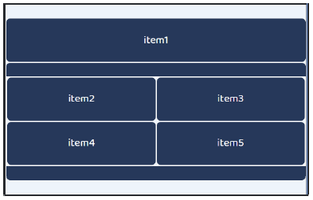
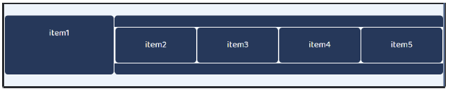

# 1. 기본 그리드 레이아웃

- 3개의 컬럼이 container 가득

```html
<div class="row p-0">
      <div class="item col">
        <p>1</p>
      </div>
      <div class="item col">
        <p>2</p>
      </div>
      <div class="item col">
        <p>3</p>
      </div>
</div>
```

- 2개의 컬럼이 container 가득

```html
<div class="row p-0">
      <div class="item col-6">
        <p>1</p>
      </div>
      <div class="item col-6">
        <p>2</p>
      </div>   
</div>
```

- 3, 6, 3칸

```html
<div class="row p-0">
      <div class="item col-3">
        <p>1</p>
      </div>  
      <div class="item col-6">
        <p>2</p>
      </div>
      <div class="item col-3">
        <p>3</p>
      </div>
</div> 
```

- 2, 7, 3칸

```html
<div class="row p-0">
      <div class="item col-2">
        <p>1</p>
      </div>
      <div class="item col-7">
        <p>2</p>
      </div>
      <div class="item col-3">
        <p>3</p>
      </div> 
    </div>
</div>
```


# 2. 반응형 그리드

- 576px 미만 : 4, 4, 4칸 / 이상 : 2, 5, 5칸

```html
<div class="row">
      <div class="item col-4 col-sm-2">
        <p>576px 미만 4 <br> 576px 이상 2</p>
      </div>
      <div class="item col-4 col-sm-5">
        <p>576px 미만 4 <br> 576px 이상 5</p>
      </div>
      <div class="item col-4 col-sm-5">
        <p>576px 미만 4 <br> 576px 이상 5</p>
      </div>
</div>
```

- 768px 미만 : 1, 3, 4, 1, 3칸 / 이상 : 2, 3, 3, 2, 2칸

```html
<div class="row">
      <div class="item col-1 com-md-2">
        <p>768px 미만 1 <br> 768px 이상 2</p>
      </div>
      <div class="item col-3 com-md-3">
        <p>768px 미만 3 <br> 768px 이상 3</p>
      </div>
      <div class="item col-4 com-md-3">
        <p>768px 미만 4 <br> 768px 이상 3</p>
      </div>
      <div class="item col-1 com-md-2">
        <p>768px 미만 1 <br> 768px 이상 2</p>
      </div>
      <div class="item col-3 com-md-2">
        <p>768px 미만 3 <br> 768px 이상 2</p>
      </div>
</div>
```

- 576px 미만 : 4, 6, 2zks / 이상 : 3, 3, 6칸 / 768 이상 : 6, 6, 12칸

```html
<div class="row">
      <div class="item col-4 col-sm-3 col-md-6">
        <p>576px 미만 4 <br> 768px 미만 3 <br> 768px 이상 6</p>
      </div>
      <div class="item col-6 col-sm-3 col-md-6">
        <p>576px 미만 6 <br> 768px 미만 3 <br> 768px 이상 6</p>
      </div>
      <div class="item col-2 col-sm-6 col-md-12">
        <p>576px 미만 2 <br> 768px 미만 6 <br> 768px 이상 12</p>
      </div>
</div>
```

- 768px 미만 : 12, 12, 12칸 / 이상  4, 4, 4칸 / 1200px 이상 : 2, 2칸 + 12칸 : 다음

```html
<div class="row">
      <div class="item col-12 col-md-4 col-xl-2">
        <p>768px 미만 12 <br> 768px 이상 4 <br> 1200px 이상 2</p>
      </div>
      <div class="item col-12 col-md-4 col-xl-2">
        <p>768px 미만 12 <br> 768px 이상 4 <br> 1200px 이상 2</p>
      </div>
      <div class="item col-12 col-md-4 col-xl-12">
        <p>768px 미만 12 <br> 768px 이상 4 <br> 1200px 이상 12</p>
      </div>
    </div>
</div>
```


# 3. 그리드 심화

- 768px 미만 : 4, 8칸 / 이상 : 양 끝 4, 4칸 + 가운데 4칸 빈 공간



```html
<div class="row">
      <div class="item col-4 col-md-4">
        <p>item1</p>
      </div>
      <div class="item col-8 col-md-4 offset-md-4">
        <p>item2</p>
      </div>
</div>
```

- 768 미만 : 양 끝 4, 4칸 + 가운데 4칸 빈 공간 / 992 미만 : 4칸 앞 빈 공간 + 4, 4칸 뒤쪽 / 이상 : 앞 7칸 빈 공간 + 5칸 + 아래 줄 : 앞뒤 2칸 빈 공간 + 8칸



```html
<div class="row justify-content-between">
      <div class="item col-4 col-md-4 offset-md-4 col-lg-5 offset-lg-7">
        <p>item1</p>
      </div>
      <div class="item col-4 col-md-4 col-lg-8 offset-lg-2">
        <p>item2</p>
      </div>
</div>
```

- 768 미만 : item 1 12칸, 4개 감싸는 박스 12칸, 내부 너비 12칸, 각각 6칸



- 768 이상 992 미만 : item 1 3칸, 감싸는 박스 9칸, 내부 너비 12칸, 각각 6칸


- 992 이상 : item 1 3칸, 감싸는 박스 9칸, 내부 너비 12칸, 각각 3칸



```html
<div class="row">
      <div class="item col-12 col-md-3 col-lg-3">
        item1
      </div>
      <div class="item col-12 col-md-9 col-lg-9">
        <div class="row">
          <div class="item col-6 col-lg-3">item2</div>
          <div class="item col-6 col-lg-3">item3</div>
          <div class="item col-6 col-lg-3">item4</div>
          <div class="item col-6 col-lg-3">item5</div>
        </div>
      </div>
    </div>
</div>
```

