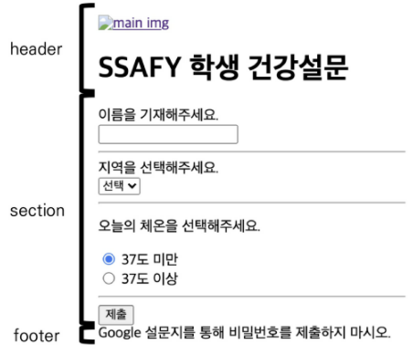
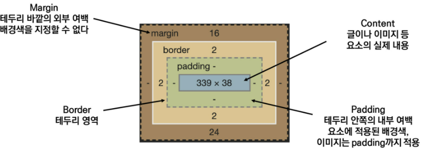
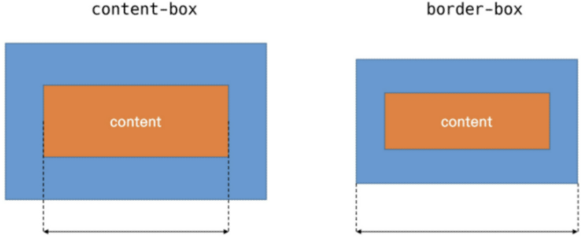
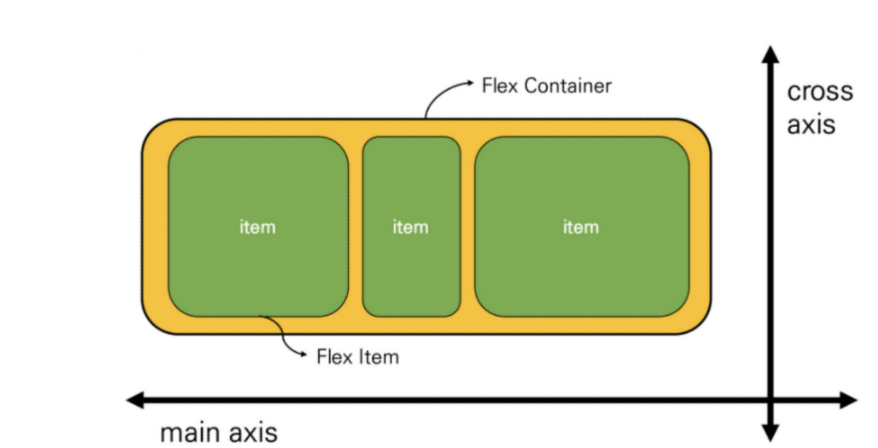
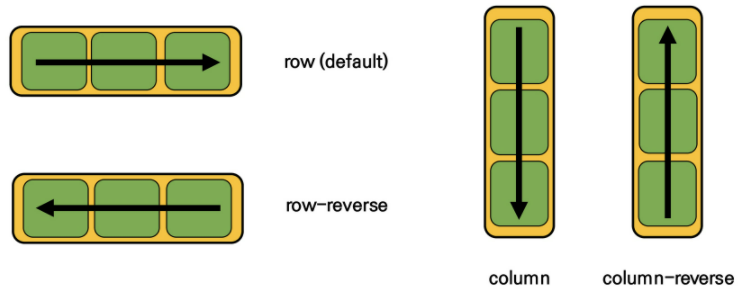
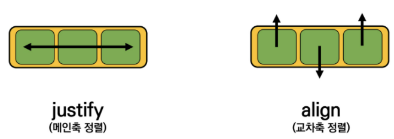

[TOC]


# Web

- `WHATWG` : Apple, Google, Microsoft, Mozilla

## HTML 

- `Hyper Text Markup Language`
  - `Hyper` : 정보가 다중으로 연결
  - `Hyper Text` 
    - 참조 (Hyper Link)를 통해 한 문서에서 다른 문서로 접근 가능한 텍스트
    - 비선형적 
  - `Markup Language` : 태그로 문서, 데이터 구조 명시 언어 -> 표현만
- 웹 콘텐츠 의미, 구조 정의

### 기본 구조

```html
<!DOCTYPE html>
<html lang="ko">
    <head>
        <meta charset="UTF-8">
        <title>Document</title>
    </head>
    <body>
        
    </body>
</html>
```

- `html` : 최상위 요소, root -> head / body
- `head` : 문서 정보, 나타나지 않음 -> CSS, 외부 로딩 파일 지정
- `body` : 나타나는 정보

#### Open Graph Protocol

#### DOM (Document Object Model) 트리

- Structured Representation (문서의 구조화된 표현) 제공
  - DOM 구조 접근 방법 제공 -> 구조, 내용 변경을 하게 도움
- 동일한 문서 표현, 저장, 조작 방법 제공
- Web Page 객체 지향 표현

#### 요소 (Element)

- 시작, 종료 태그, 태그 사이 내용
- 중첩 가능

#### 속성 (Attribute)

- 태그 부가적인 정보
- 요소의 시작 태그에 작성
- 태그와 상관 없이 사용 가능 : HTML Global Attribute
  - `id`, `class`, `hidden`, `lang`, `style`, `tabindex`, `title`

#### 시맨틱 태그

- 의미를 가진 태그
  - `header`
  - `nav` : 내비게이션
  - `aside` : 사이드 사이 공간, 메인과 관련 low
  - `section` : 문서의 일반적인 구분, 콘텐츠와 그룹 표현
  - `article` : 독립적으로 구분되는 영역
  - `footer`

### 문서 구조화

#### 인라인 / 블록 요소

#### 그룹 콘텐츠

- `<p>`
- `<hr>`
- `<ol>`, `<ul`>
- `<pre>`, `<blockquote>`
- `<div>`

#### 텍스트 관련

- `<a>`
- `<b>`, `<strong>`
- `<i>`, `<em>`
- `<span>`, `<br>`, ``

#### Table

- `<tr>`, `<td>`, `<th>`
- `<thead>`, `<tbody>`, `<tfoot>`
- `<caption>`
- 셀 병합 : `colspan`, `rowspan`
- `scope`
- `<col>`, `<colgroup>`

#### form

- 데이터 제공
- `action`, `method`

#### Input

- `<label>` : 서식 입력
- `name`, `placeholder`, `required`, `autofocus`



```html
<header>
	<a href="https://www.ssafy.com/">
    	
    </a>
    <h1>
        SSAFY 학생 건강설문
    </h1>  
</header>
```

```html
<section>
	<form action="#">
        <!-- 이름 -->
        <!-- 지역 -->
        <!-- 체온 -->
        <input type="submit" value="제출">
    </form>
</section>
```

```html
<div>
    <label for="name">이름을 기재해주세요.</label><br>
    <input type="text" id="name" name="name" autofocus>
</div>
```

```html
<div>
    <lable for="region">지역을 선택해주세요.</lable><br>
    <select name="region" id="region" required>
        <option value="">선택</option>
        <option value="서울">서울</option>
        <option value="대전">대전</option>
        <option value="광주">광주</option>
        <option value="구미">구미</option>
        <option value="강원" disabled>강원</option>
    </select>
</div>
```

```html
<div>
    <p>
        오늘의 체온을 선택해주세요
    </p>
    <input type="radio" name="body-heat" id="normal" value="normal" checked>
    <label for="normal">37도 미만</label><br>
    <input type="radio" name="body-heat" id="warning" value="warning">
    <label for="warning">37도 이상</label>
</div>
```

```html
<footer>
	Google 설문지를 통해 비밀번호를 제출하지 마시오.
</footer>
```

## CSS

- Cascading Style Sheets : 스타일, 레이아웃을 통해 문서 (HTML) 표시 방법 지정

```css
h1 { /* 선택자 (Selector) */
    color: blue; /* 선언 (declaration) */
    font-size: 15px; /* 속성 (Property): 값 (Value) */
}
```

#### 정의 방법

- 인라인 (`Inline`) : 해당 태그에 직접
- 내부 참조 (`Embedding`) : `<head>` 태그 내 `<style>`
- 외부 참조 (`Link File`) : 분리된 CSS 파일, `<head>` 내 `<link>`

### Selectors

- 기본 선택자
  - 전체, 요소 (직접 선택)
  - 클래스 : 마침표 문자로 시작, 적용된 모든 항목 선택)
  - 아이디 : # 문자로 시작, 적용된 모든 항목 선택, 1번만 사용 
  - 속성
- 결합자 (Combinator)
  - 자손, 자식
  - 일반 형제, 인접 형제
- 의사 클래스 / 요소 (pseudo class)
  - 링크, 동적
  - 구조적

#### 우선순위 (Cascading Order)

- `!important`
- 인라인 > id 선택자 > class 선택자 > 요소 선택자
- 소스 순서

### 단위

#### 크기

- px (픽셀) : 고정적 단위
- % : 백분율, 가변적 레이아웃
- em : 상속 영향 -> 배수, 요소 지정 사이즈에 상대적
- rem : 상속 영향 X -> 최상위 요소 (html) 사이즈 기준 배수 단위
- viewport : 웹 페이지 -> 스마트폰, 태블릿
  - vw, vh, vmin, vmax

#### 색상

- 키워드 : 직접 글자로
- RGB : '# + '16진수, rgb 함수형 표기법
- HSL : 색상, 채도, 명도

```css
p {color: black;}
p {color: #000;}
p {color: #000000;}
p {color: rgb(0, 0, 0);}
p {color: hsl(120, 100%, 0);}

p {color: rgba(0, 0, 0, 0.5);}
p {color: hsla(120, 100%, 0, 0.5);} /* a : alpha (투명도) */
```

#### 결합자 (Combinator)

- 자손 : selectorA 하위 모든 selectorB 요소
- 자식 : selectorA 바로 아래 selectorB 요소, >

```css
/* 자손 */
div span {
    color: red;
}

/* 자식 */
div > span {
    color: red;
}
```

- 일반 형제 : selectorA 형제 요소 중 뒤 selectorB 요소 모두, ~
- 인접 형제 : selectorA 형제 요소 중 바로 뒤 selectorB 요소, +

```css
/* 일반 형제 */
p ~ span {
    color: red;
}

/* 인접 형제 */
p + span {
    color: red;
}
```

### Box model



- content-box : Padding 제외 순서 Contents 영역
- border까지 너비 : `box-sizing`을 `border-box`로 설정



#### 마진 상쇄

### Layout

#### Display

- `block` 
  - 줄 바꿈, 화면 전체 가로 폭, 블록 레벨 안 인라인 가능
  - `div` / `ul`, `ol`, `li` / `p` / `hr` / `form`
- `inline` 
  - 줄 바꿈 X 행 일부, content 너비 가로 폭
  - width, height, margin 지정 X
  - 상하 여백 : line-height
  - `span` / `a` / `img` / `input`, `label` / `b`, `em`, `i`, `strong`
- `inline-block`
  - block, inline 모두
    - inline : 한 줄에 표시
    - block : width, height, margin 지정
- `none`
  - 화면에 표시, 공간 X
  - `hidden` : 공간 O, 표시 X

#### Position

- `static` : 기본 값 (기준 위치), 부모 요소 내 -> 부모 요소 위치 기준
- `relative` : 자기 자신 static 위치 기준
- `absolute` : 공간 X, 부모/조상 요소 기준 이동, 다른 것과 별개 위치
- `fixed` : 공간 X, viewport 기준 이동, 스크롤 시에도 항상

#### Float

- `none` : 기본값
- `left`
- `right`
- `clear` : 선행 floating 요소 다음일지, 내려가야 할지 (`cleared`)

```css
.clearfix::after {
    content: "";
    display: block;
    clear: both;
}
```

#### Flexbox

- 공간 배분, 정렬 -> 1차원 (단방향) 레이아웃

- 요소
  - `Flex Container` (부모)
    - display : `flex`, `inline-flex`
  - `Flex Item` (자식)

```css
.flex-container {
    display: flex
}
```

- 축
  - `main axis`
  - `cross axis`



- 속성

  - `inline-flex` : flex 영역 `inline`으로 사용

  - 배치 방향 : `flex-direction`

    - main axis 방향만

    

  - 메인 축 방향 : `justify-?`

    - `main`, `flex-start`, `flex-end`, `center`
    - `space-between`, `space-around`, `space-evenly`

  - 교차 축 방향 : `align`-?

    

    - `content` : 여러 줄
    - `items` : 한 줄
    - `self`: item 개별 요소

  - 기타  

    - `flex-wrap` : 한 줄 배치
      - `nowrap` : 자리가 없어도 튀어나옴
      - `wrap` : 넘치면 그 다음 줄
      - `wrap-reverse` : 넘치면 그 윗 줄
    -  `flex-flow` : `flex-direction` + `flex-wrap`
    - `flex-grow` : 남는 공간 분배
    -  `order` : 작을 수록 앞으로 이동

## Bootstrap

### CDN

- Content Delivery (Distribution) Network

### Spacing

| Class name | rem  |  px  |
| :--------: | :--: | :--: |
|    m-1     | 0.25 |  4   |
|    m-2     | 0.5  |  8   |
|    m-3     |  1   |  16  |
|    m-4     | 1.5  |  24  |
|    m-5     |  3   |  48  |

### bootstrap grid system

- `Flexbox`
- `container`, `rows`, `column`으로 배치
- 12개 `column`, 6개 `grid breakpoints`

## Responsive Web

- 다양한 화면 크기